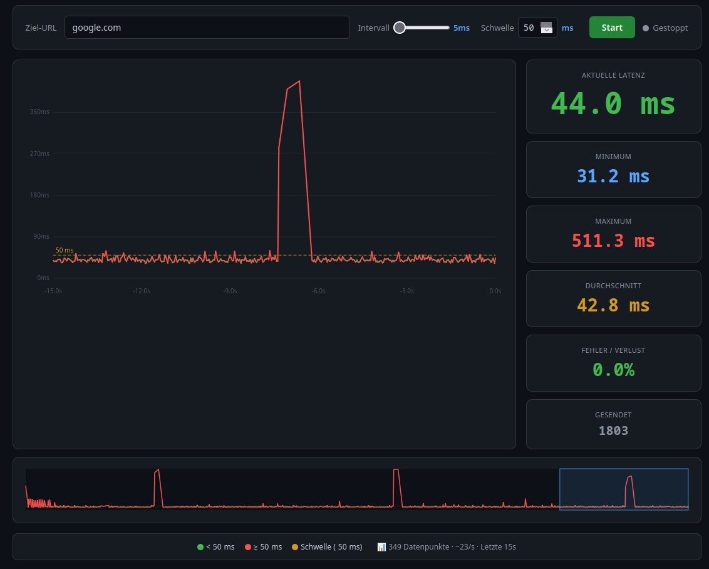

<h1>
  
  Latency Test
</h1>

Real‑time HTTP latency monitoring with a live chart and configurable threshold.



## Features

- **Fast polling** – down to every 5 ms (configurable)
- **Live chart** – scrolling timeline with color coding (green/red)
- **Overview bar** – full data history with selection zoom
- **Configurable threshold** – adjustable color switch point
- **Statistics** – current, min, max, avg, error rate
- **IP / URL** – direct input without `http://`

## Getting Started

```bash
uv run python main.py
```

Open [http://localhost:8000](http://localhost:8000) in your browser, enter a target, and click **Start**.
